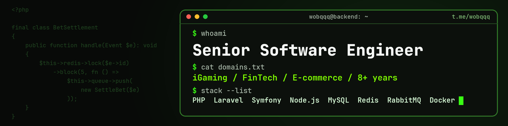

<p align="center">
  
</p>

<p align="center">
  
</p>

```bash
$ whoami
Sergey Zakharevich — Senior Backend Developer & Software Architect

$ cat about.txt
8+ years designing, building and scaling secure, high-load web applications.
Architect on several projects: system design, stack selection, key technical decisions.
Security by design: payments, banking and real-money gaming taught me to build safe systems from day one.
AI integrations: OpenAI, Claude and Gemini inside real business products.

$ cat domains.txt
iGaming (sportsbook, casino, poker) · FinTech & banking · Crypto payments · E-commerce · Healthcare · Media

$ status
Open to remote opportunities — full-time and contract
```

### 🛠 Stack

<p align="left">
  
  <br>
  
  <br>
  
</p>

Also: OctoberCMS · Beanstalkd · Memcached · Apache · REST · GraphQL · PHPUnit · CI/CD

### 🤖 AI in my work


I build LLM-powered features into products and use AI-assisted development daily for prototyping, refactoring and tests — so I can focus on architecture, security and quality.

### 🛡️ Featured: oc-fortify — security suite for October CMS

| Repository | What it does |
|---|---|
| [oc-fortify-plugin](https://github.com/wobqqq/oc-fortify-plugin) | Core suite: system diagnostics, vulnerability checks, protection tools |
| [oc-fortify-csp-plugin](https://github.com/wobqqq/oc-fortify-csp-plugin) | Content Security Policy headers against XSS and data injection |
| [oc-fortify-input-sanitizer-plugin](https://github.com/wobqqq/oc-fortify-input-sanitizer-plugin) | Sanitization of user input against XSS and injection |
| [oc-fortify-admin-ip-access-plugin](https://github.com/wobqqq/oc-fortify-admin-ip-access-plugin) | Admin panel access restricted to whitelisted IPs |
| [oc-ide-helper](https://github.com/wobqqq/oc-ide-helper) | Better IDE autocompletion for October CMS projects |

[](https://octobercms.com/author/Wobqqq)

### ⚙️ Principles

```text
Code:          KISS · DRY · YAGNI · SOLID · clean, readable, maintainable code
Architecture:  separation of concerns · loose coupling · idempotency · scalability first
Security:      security by design · least privilege · defense in depth · never trust user input
Delivery:      tests before refactoring · code review · automate everything (CI/CD)
```

### 📫 Contact

[](https://www.linkedin.com/in/wobqqq)
[](https://t.me/wobqqq)
[](mailto:wobqqq@gmail.com)
